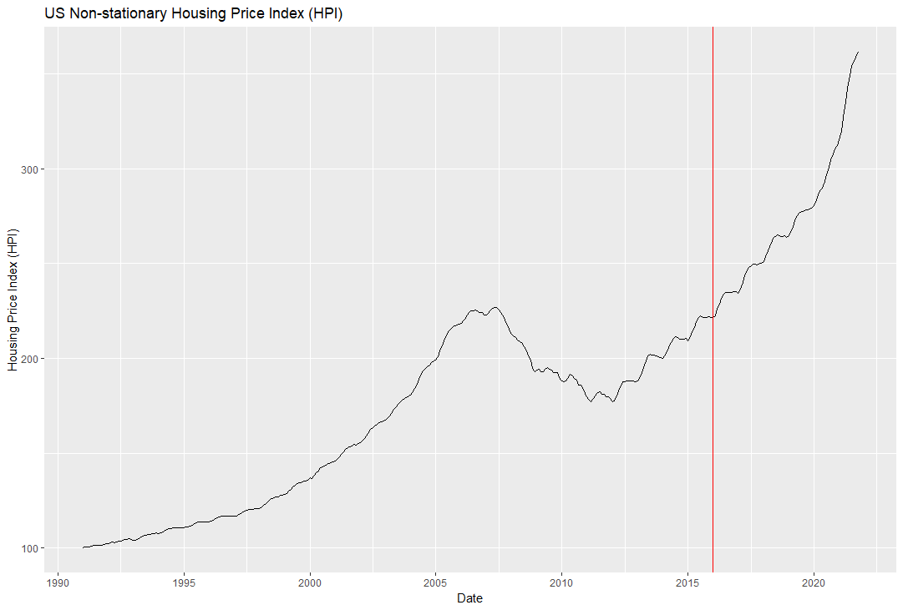
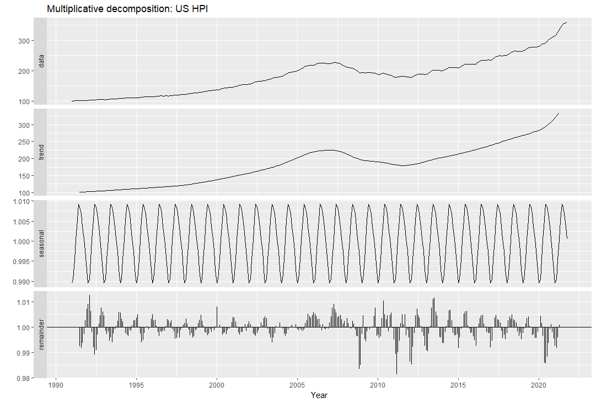
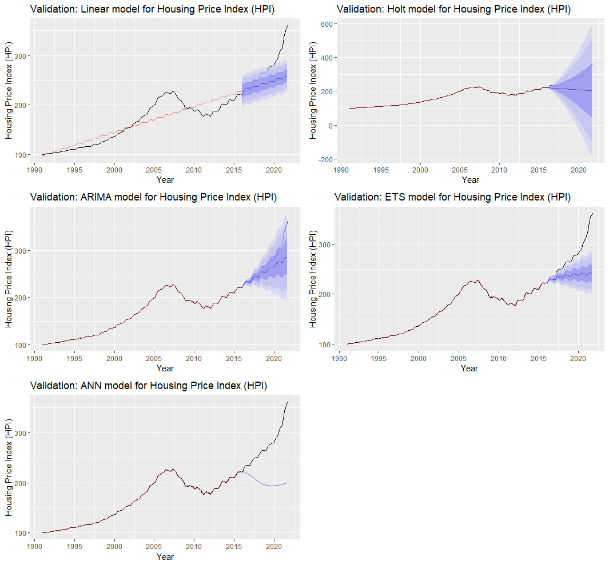
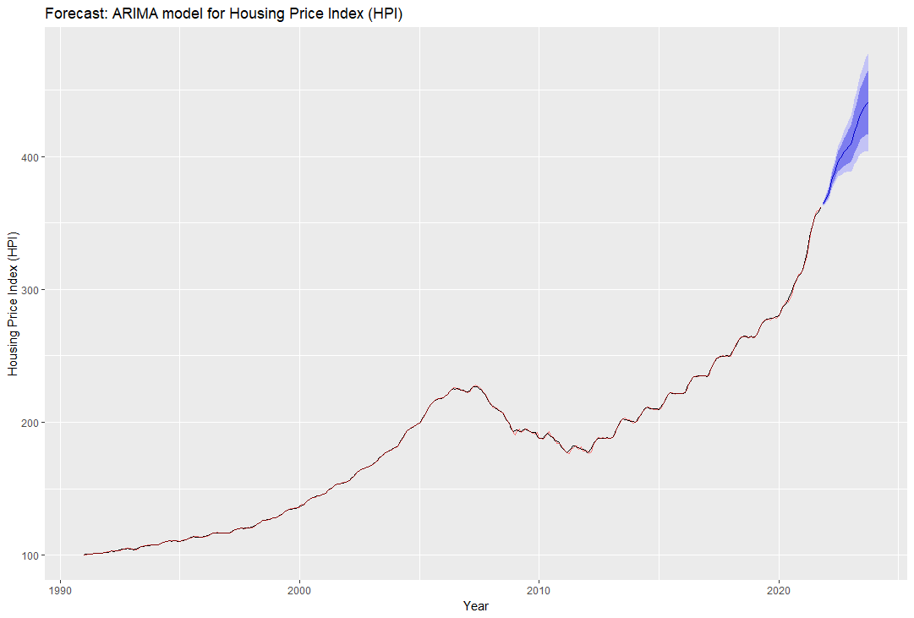

## Time Series Forecast in R
 
Time Series are an extensive area of analysis in many data-related fields. Basic time series tools are available for almost every major and popular Data Science programming language, whether built-in or from well-known developers and collaborators. From the technical standpoint, it is a powerful asset to add to your toolbox and the ever-evolving nature of Data Science algorithms ensures a growing and more advanced 

Whether you are analyzing macroeconomics, customer default risk, or seasonal marketing campaigns, there is always an opportunity (and almost a necessity) to work with time series. Analyzing the past helps us understand and describe specific phenomena but the true power lies on forecasting and being better prepared for the future or your business, your clients, or the overall economy.

This brief application is not intended to provide the theoretical foundations of time series, statistical model fitting and tuning, validation, or visualization. This application is intended as a hands-on approach to build upon and modify based on the needs of your project.

# Application case

To demonstrate the use of these essential and classic methods, we will forecast the US House Index Price (HPI). This index tracks the housing price evolution and can be extremely helpful to make financial decisions for households or real estate investment opportunities. The index is provided and maintained by the Federal Reserve Bank of St. Louis [(FRED)](https://fred.stlouisfed.org/series/USSTHPI) based on data from the U.S. Federal Housing Finance Agency.

I recommend you to [download](https://github.com/renatoguadamuz/TimeSeries_Forecast/blob/main/HPI_Forecast.R) the R script and run along with this brief explanation to corroborate that your code works as intended and modify as you please.

The "reset environment" and 'packages" sections are extremely useful as headers for any projects. The former provides a clean sleet to work on any project or even a small script and the latter automatically verifies if the required packages are installed and/or loaded and proceeds to install and load them if they are not immediately ready. This script requires (but automatically downloads) the following libraries: "xts", "forecast", "lubridate", "ggplot2", and "gridExtra". Note that if you do not want to have your libraries updated for compatibility with other scripts, you can manually load the libraries instead.

The data is read directly as a [csv](https://www.fhfa.gov/HPI_master.csv) from the website of the of the FRED, filtered, cleaned, and ready to be used with the minimal information needed. The master HPI file contains other housing indices for specific locations or conditions. Feel free to explore if there is anything particularly useful for you!!



The standard validation split for non-temporal data is usually around 80% for training and 20% for testing. For time series, these suggestions generally apply but, in broader terms, it is recommended that the testing set extends for a period no-less-than the required for the forecast, for example, if you need to forecast two years (like in this application), the testing data set must be at least two years as well. A longer testing period may be used but keep in mind that further forecasts are less accurate by nature and evident by confidence intervals (if the method allows). There are many automated and advanced packages and methods even for data splitting (like caret, bootstrapping, etc.) but I will keep things simple.

Once the split date for training and testing is set. The next step is to decompose the training time series or at least the entire series. Long-term series like the HPI can easily hide other effects aside from the trend because of the large magnitude changes over long periods. Series decomposition typically presents the trend, seasonality, and errors. This initial step allows to hypothesize what types of trends (additive or mutiplicative, for instance) seasonality periodicity, and if there are still patterns in the errors that may indicate useful information for model fitting.



This application uses the most basic and classic time series methods. There are much more advanced and accurate methods (XGBoost being one of my favorites) but a solid conceptual foundation and understanding of classical methods is seriously recommended before diving into "black box" methods without understanding their differences, interpretation or ranges of application. The methods used are linear regression of trend and season, Holt-Winters, ARIMA, exponential smoothing, and artificial neural networks. The latter was not considered a classic method decades ago, but given the great advances in deep learning, machine learning, and artificial intelligence, there is a general agreement that the basic concepts of simple small neural networks should be studied as initial less-powerful methods.

I will not dive into the reasons for which each model performs better or worse (once again, this application does not replace the theoretical foundation needed for deeper understanding). However, I analyze the results from a pragmatic standpoint. Holt-Winters and Artificial Neural Networks present a clear overfit of the training data and poor performance for the testing set. The linear fit does not explain the model well enough for either of the datasets. The ARIMA and the exponential (ETS) models present the best testing fit without clear signs of overfitting. These results can be observed in the following plots:



The training set is used for each method to fit a model (without observing the testing dataset) and validated with the testing dataset. The accuracy of both fitting and validation are calculated with the following measures of accuracy:
- Mean Error (ME)
- Root Mean Square Error (RMSE)
- Mean Absolute Error (MAE)
- Mean Percentage Error (MPE)
- Mean Absolute Percentage Error (MAPE)
- Mean Absolute Scaled Error (MASE)
- Autocorrelation of errors at lag 1 (ACF1) 
- Theil’s uncertainty coefficient (Theil’s U)

Each measure of accuracy presents useful different attributes. Depending on the needs of the project (e.g., detection of outliers, direction of the error, or consistency across measures) specific measures provide more meaningful evaluations. For this example, I will focus on the general fit of the model without a particular interest in individual measures. You can find more information about the calculation, interpretation, and implications of each measure [here](https://otexts.com/fpp2/accuracy.html).
The testing accuracy is more pertinent because it assesses the ability of the model to correctly predict unseen observations. The lower errors indicate less deviation between the model forecast and the historical value and it is preferred.

```
Training
         ME  RMSE   MAE   MPE MAPE MASE ACF1
Linear 0.00 18.56 14.12 -1.24 8.02 1.63 1.00
Holt   0.00  0.81  0.54  0.00 0.32 0.06 0.01
ARIMA  0.01  0.63  0.42  0.01 0.24 0.05 0.03
ETS    0.12  0.70  0.52  0.09 0.31 0.06 0.36
ANN    0.01  0.95  0.69  0.00 0.39 0.08 0.59

Testing
          ME  RMSE   MAE   MPE  MAPE MASE ACF1 Theil's U
Linear 26.45 36.52 27.18  8.87  9.20 3.14 0.93     12.41
Holt   57.14 68.86 57.14 19.81 19.81 6.59 0.94     24.26
ARIMA  14.62 22.46 14.85  4.82  4.92 1.71 0.91      7.40
ETS    34.02 45.06 34.16 11.53 11.60 3.94 0.93     15.43
ANN    66.96 78.33 67.00 23.40 23.42 7.73 0.94     28.08
```

After the models have been evaluated and validated, the best model is chosen for the proper forecast. A few models can be chosen if the results are not entirely clear, if the accuracy is very similar among the chosen models, or the different fits present very distinct properties that are not reflected on the accuracy tables displayed above. In this case, the ARIMA model is undoubtedly the best fit. Again, I will not dive into details about how an ARIMA model is specified or interpreted, but one crucial aspect is that we must use the same model as the one determined during the validation process (otherwise would have been useless), therefore, we must also perform the final forecast with an ARIMA(1,1,1)(0,1,1)[12] (the ARIMA model we determined using auto.arima for the training dataset). You have to be careful when using ```auto.arima()``` because the optimal (P,D,Q) combination might be overlooked or you could prefer a different model for other reasons (like compromising aic selection for other method or technical background of the series). According to our best performing model (ARIMA), we expect the House Price Index to keep rising for the following 24 months.



A huge disclaimer is typical for any time series fit like the presented above. All forecasts assume that historical patterns are expected to repeat over time. Within reasonable confidence, that is, up to the 95% confidence intervals from the ARIMA model, we expect the House Price Index to continue to rise for the following 24 months using merely time series forecasting. 

I am also passionate about developing tools to predict the highly volatile stock market and other financial instruments. Some of these tools can be used to determine when a general time series will change its trend. If you are curious, visit [this repository](https://github.com/renatoguadamuz/USSTHPI) for more information.
